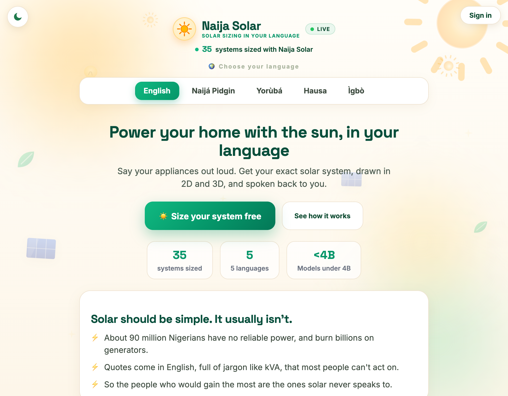
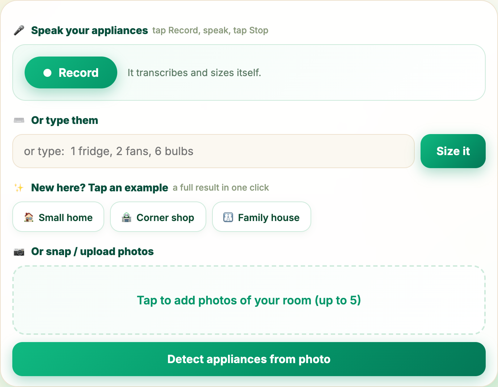
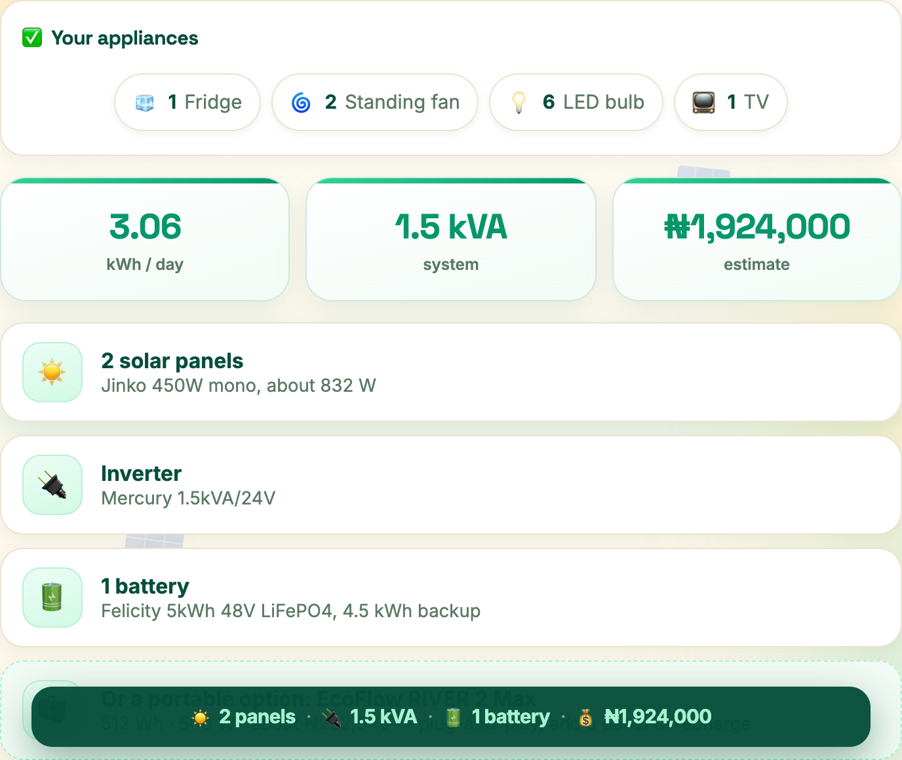
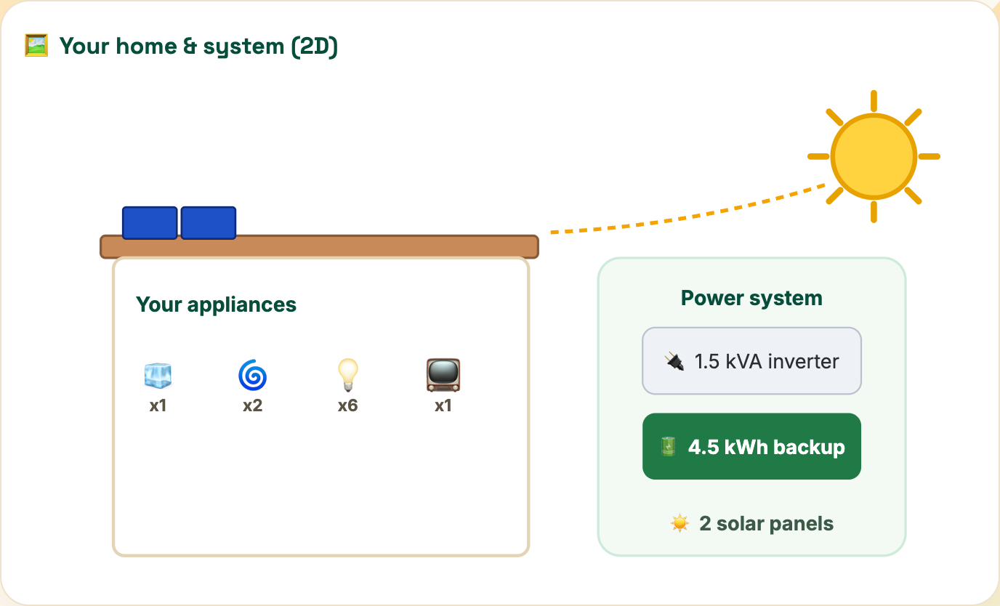
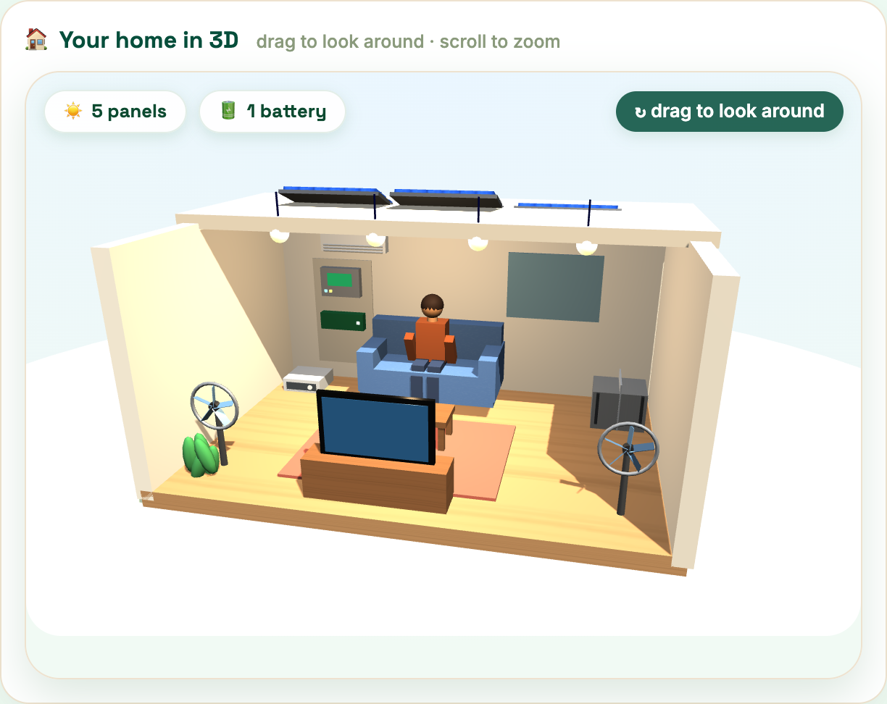
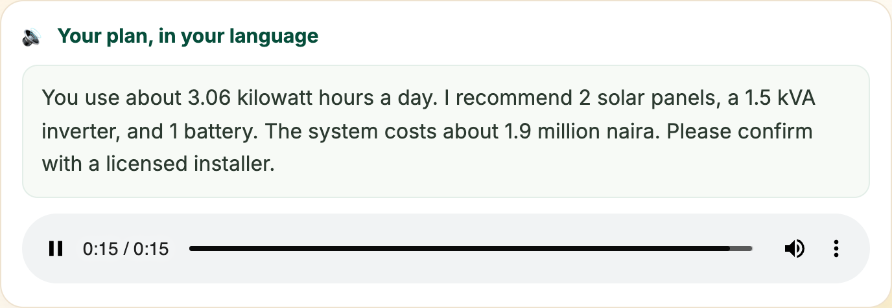
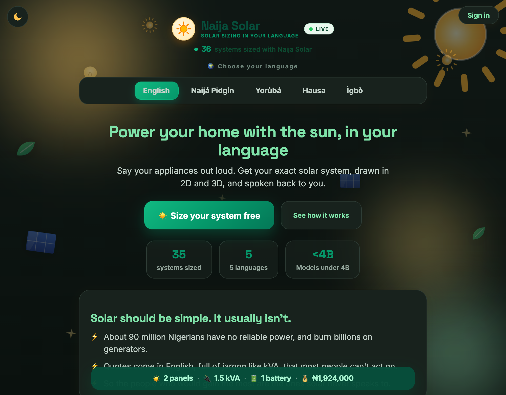
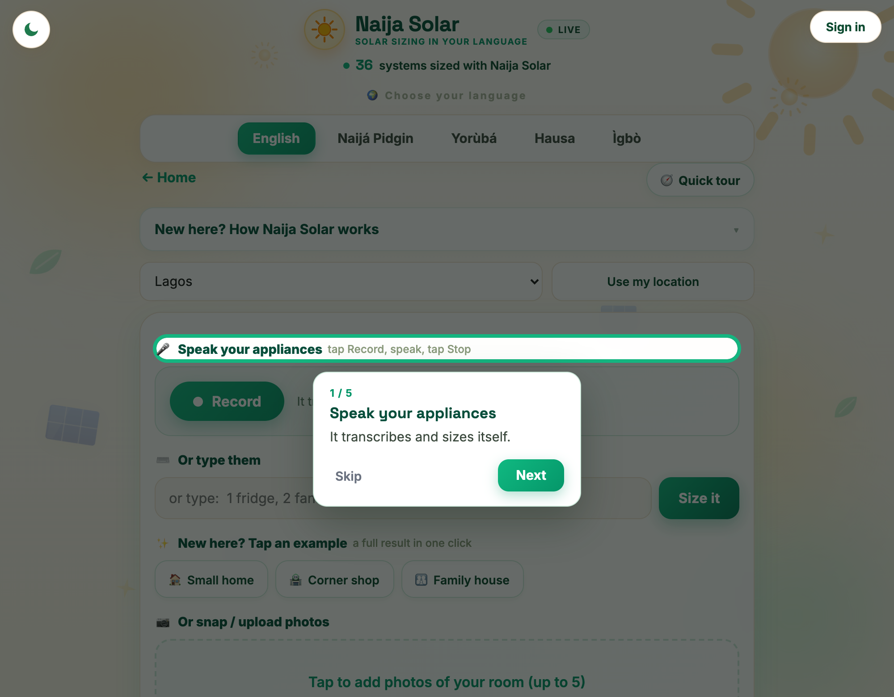
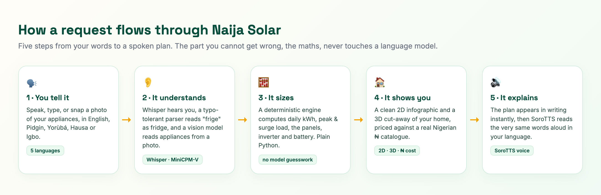
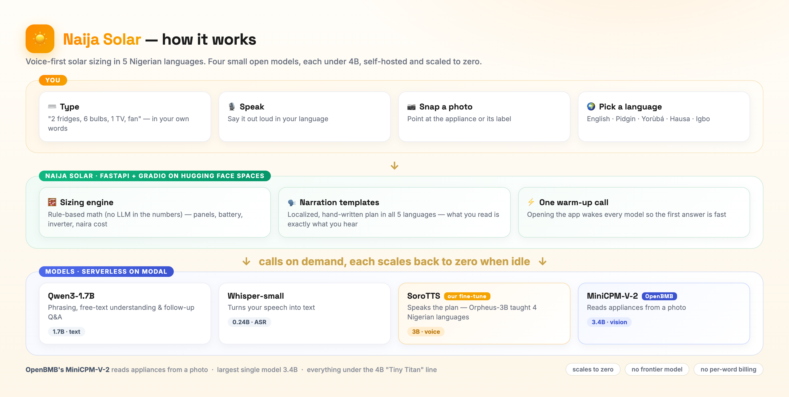

# ☀️ Naija Solar

**Say what you run at home, in your own language, and get the exact solar system you need.**

Naija Solar is a voice-first solar-sizing assistant for Nigeria. Speak, type, or photograph your appliances in **English, Nigerian Pidgin, Yorùbá, Hausa, or Igbo**, and it works out the panels, inverter, and battery you need, prices them against a real Nigerian catalogue, draws your home in **2D and 3D**, and **reads the plan back to you in your own language**. Every model it uses is **under 4 billion parameters**.

🔗 **Live demo:** https://huggingface.co/spaces/build-small-hackathon/naija-solar &nbsp;·&nbsp; 🎥 **[Watch the demo](https://youtu.be/PfQeRfNof8Y)**
🏆 Built for the **Build Small Hackathon** (Gradio × Hugging Face) · 🇳🇬 Built in Nigeria · ⚖️ MIT licensed

[](https://youtu.be/PfQeRfNof8Y)



---

## Why it exists

Electricity in Nigeria is something you plan your day around. The grid shows up for a few hours if you are lucky, and the rest of the time the streets fill with the sound of petrol generators. Solar is the obvious way out, the sun is free and panels have never been cheaper, yet almost no one makes the switch. The reason is not the hardware. It is that solar is never explained in a way an ordinary person can act on.

- **About 90 million Nigerians have no reliable electricity**, the largest access gap of any country on earth, and the country spends roughly **14 billion dollars a year** running generators to fill it.
- **More than one in three adults cannot comfortably read** a vendor quote or a spec sheet. Adult literacy sits near 62 percent, and far lower in parts of the north.
- **English shuts most people out.** Nigeria has over 500 languages; tens of millions live their whole day in Hausa, Yorùbá, Igbo, or Pidgin, the very languages solar is almost never explained in.
- **The knowledge gap is the real wall.** Even people who can afford a system stall on the same three questions: how many panels, what size inverter, which battery. The answers hide behind kVA jargon and quotes that disagree with each other.

This is exactly where small, local AI earns its place. Naija Solar goes after the part the industry skips, the **understanding**. If you can speak, in your own language, you can size your system. No reading, no English, and no jargon required.

## What it does

| Step | How |
|---|---|
| **1. Tell it your load** | 🎤 Speak it, ⌨️ type it, tap an example, or 📷 snap a photo of your room |
| **2. It understands you** | Speech recognition, typo-tolerant parsing ("frige" becomes fridge), and a vision model that reads appliances from photos |
| **3. It sizes the system** | A **deterministic engine** computes daily kWh, peak and surge load, the panel array, inverter kVA, and battery bank. The maths is plain Python you could check by hand, never a model guess |
| **4. It shows you** | A clean **2D** infographic and an interactive **3D** cut-away of your home, a 24-hour sun-versus-usage chart, and ₦ cost cards over a real vendor catalogue |
| **5. It explains, in writing and aloud** | The plan appears **in words instantly**, then the **same words are read aloud** in your language. Ask a follow-up like "can I add an AC later?" and it answers, grounded in your plan |

You can speak, type, tap an example, or photograph your room, all from one card:



It then sizes the system and shows the headline numbers and the exact recommended hardware, priced in naira:



## See your home, in 2D and 3D

A clean, labelled **2D** diagram lays out your appliances, the panels on your roof, and the power system, so the whole thing makes sense at a glance:



And for the part that makes people smile, it builds your living room in **3D**, with the recommended panels on the roof and your appliances inside:



## It writes your plan, then reads it aloud

The moment your result is ready, the plan appears **in plain words on the screen**, and then the **very same words are read aloud** in the language you chose, by a voice we built ourselves (more below). Putting the writing first matters: a voice has to warm up and speak, which takes a few seconds, but the words are there instantly, so you are never left watching a spinner.



For Yorùbá, Hausa, and Igbo the spoken plan is phrased the way a person actually speaks, with the counts as native number words rather than bare digits, while the exact figures stay on the cards. So the voice sounds natural, and what you read is what you hear.

## Features

- 🗣️ **Voice-first** input with speech recognition, plus type, example, and photo paths.
- 🌍 **Five languages**, end to end. Switching language re-skins the **entire** app and the spoken plan.
- 📝 **Written plan, instantly**, then read aloud in the same words, so a slow or cold voice never blocks you.
- 📷 **Photo read-back.** When it reads your room, it shows you **exactly what it spotted** so you can confirm or adjust.
- 🔄 **Size another system** in one tap, without losing your place.
- 🏠 **2D and 3D** of your specific home, with the recommended panels, appliances, inverter, and battery.
- 💬 **Ask anything** about your plan, panels, savings, generators, or adding load later.
- 👤 **Accounts and history**, save your sizings and open them again any time.
- 🌗 **Light and dark mode**, remembered across visits.
- 🧭 **Guided first-run tour** that walks new users through every step, in their language.
- 💛 **Ratings and testimonials** from real users (with the language they used), a live "systems sized" counter, and optional email capture.



A guided first-run tour walks every new user through the app, in their own language:



## The models, every one under 4B (Tiny Titan)

| Role | Model | Params |
|---|---|---|
| Text (Q&A + free-text understanding) | `Qwen/Qwen3-1.7B` | **1.7B** |
| Speech to text | `openai/whisper-small` | **0.24B** |
| Voice (all 5 languages) | **[SoroTTS](https://huggingface.co/Shinzmann/sorotts)**, our own Orpheus-3B fine-tune | **3B** |
| Vision (appliances from a photo) | `openbmb/MiniCPM-V-2` (OpenBMB MiniCPM) | **3.4B** |

The **photo reader is OpenBMB's `MiniCPM-V-2`**: point your phone at an appliance or its rating label and it lists what you run, so a user who can't easily type still gets sized. That is the largest single model at **3.4B**, comfortably under the 4B line. Text (Q&A and reading messy free-text appliances) runs on `Qwen/Qwen3-1.7B`, served on Modal ([`modal/serving_text_dual.py`](modal/serving_text_dual.py)). Everything is self-hosted on **Modal**, where each model wakes on demand and scales back to zero when idle, so there is no GPU bill running in the background.

To keep the five languages dependable, the **words** of the spoken plan come from carefully written, localized templates rather than a small model, because a 1.7B model is not reliable at Yorùbá, Hausa, or Igbo prose yet. The same templates are what you see written on screen, so the words you read are exactly the words you hear.

Those words are then **spoken by SoroTTS**, a voice we built ourselves. Off-the-shelf TTS for Nigerian languages is either robotic or absent, so we fine-tuned **Orpheus-3B** (a natural open speech model that had no Nigerian languages) on Yorùbá, Hausa, Igbo, and Nigerian Pidgin, training a single LoRA adapter over 31,574 clips from NaijaVoices, WAXAL, FLEURS, BibleTTS, and the Nigerian Pidgin corpus. The result, [`Shinzmann/sorotts`](https://huggingface.co/Shinzmann/sorotts), is native and natural, and still under the 4B line. The whole fine-tune runs on Modal ([`modal/finetune_orpheus.py`](modal/finetune_orpheus.py)); see that model card for the full story.

## Architecture

```
Browser  ──►  FastAPI app  ──►  small open models on Modal (scale to zero)
(web/)        (server.py)        text · speech · voice · vision
                  │
                  ├─ deterministic sizing engine (engine.py)  ← the honest core, pure Python
                  ├─ Nigerian ₦ price catalogue (dataset/)
                  ├─ accounts, history, ratings (store.py, /data)
                  └─ persistent voice cache (/data)
```

A request flows through five steps, and the part you cannot afford to get wrong, the maths, never touches a language model:



The front end is an ordinary Hugging Face Space on a **free CPU box**. It holds the interface, the parser, the sizing engine, and the price catalogue, and it draws the 2D and 3D views right there on your device. Whenever it needs to hear, see, or speak, it calls a handful of small models hosted on Modal, each scaling to zero when idle. A persistent cache on `/data` keeps generated voice clips between restarts, so repeat plans play back instantly.

Because the models sleep when idle, the app **warms all of them the moment you open it** and shows a brief loading note, so the first request after a lull is only a few seconds slower, and there is no GPU bill while nobody is using it.



The interface is hand-built (`web/index.html`, `web/app.js`, `web/shell.css`) and served by FastAPI, reusing all of the Python generators, the 3D scene, and the design system, so none of the default framework look is left.

## Project structure

```
server.py        FastAPI app: routes, auth, the bespoke frontend
app.py           core logic: parsing, sizing, 2D/3D, narration, Q&A, generators
engine.py        the deterministic sizing engine (pure math)
store.py         accounts, saved sizings, ratings (durable, /data)
strings.py       full 5-language UI strings + seed testimonials
dataset/         real Nigerian panel / inverter / battery catalogue
web/             the hand-built frontend (HTML, CSS, JS)
buildsmall/      small shared layer that talks to the models
modal/           Modal serving scripts for each model + the SoroTTS fine-tune
Dockerfile       container for Hugging Face Spaces (uvicorn on :7860)
```

## Run locally

```bash
pip install -r requirements.txt

# Runs immediately on the deterministic core (sizing, 2D/3D, recommendations) with a dev mock:
uvicorn server:app --host 0.0.0.0 --port 7860
# open http://127.0.0.1:7860
```

To wire the live models, point the app at your model endpoints and run again:

```bash
export BUILDSMALL_BACKEND=openai
export BUILDSMALL_BASE_URL=https://<your-modal-vllm>/v1
export BUILDSMALL_TEXT_MODEL=Qwen/Qwen3-1.7B
export BUILDSMALL_ASR_BASE_URL=https://<your-modal-whisper>/v1
export BUILDSMALL_TTS_BASE_URL=https://<your-modal-tts>/v1
export BUILDSMALL_VISION_BASE_URL=https://<your-modal-vision>/v1
export BUILDSMALL_API_KEY=<a strong secret you choose>
uvicorn server:app --host 0.0.0.0 --port 7860
```

### Self-hosting the models on Modal

Each model has a serving script in `modal/`. Deploy the ones you need and point the `BUILDSMALL_*_BASE_URL` variables above at the printed URLs:

```bash
pip install modal && modal token new
modal deploy modal/serving_text_dual.py  # text (Qwen3-1.7B)
modal deploy modal/serving_whisper.py    # speech to text
modal deploy modal/serving_tts.py        # voice (SoroTTS, our Orpheus-3B fine-tune)
modal deploy modal/serving_minicpm.py    # vision (MiniCPM-V-2, OpenBMB), primary
# modal deploy modal/serving_vision.py   # vision fallback (Qwen2.5-VL-3B), same slot + interface
```

To (re)train the SoroTTS voice yourself, the whole pipeline (stream + SNAC-encode the data, LoRA-train, push to the Hub) runs as one Modal job:

```bash
modal run --detach modal/finetune_orpheus.py     # full run, pushes <your-hf>/sorotts
modal run modal/test_sorotts.py                  # synthesize a sample per language
```

Set a strong `ENDPOINT_API_KEY` secret on Modal and use the same value for `BUILDSMALL_API_KEY` so the endpoints are not open to the public.

## Deploy to Hugging Face Spaces

The included `Dockerfile` runs the app on port 7860. Create a **Docker** Space, push this repo, set the `BUILDSMALL_*` variables above (the API key as a **secret**), and add the Spaces config to the top of your Space `README.md`:

```yaml
---
title: Naija Solar
emoji: ☀️
sdk: docker
app_port: 7860
---
```

Persistent storage mounted at `/data` keeps accounts, saved sizings, ratings, and the voice cache between restarts.

## Ethics and limits

Estimates only. Every result says **confirm with a licensed installer**. Prices are current Nigerian bands and will drift over time. The free-form Q&A answers in clear English for Yorùbá, Hausa, and Igbo, because a 1.7B model garbles long prose in those languages, while the whole interface and the spoken plan stay in the chosen language. SoroTTS is for accessibility, not for cloning any real person's voice.

## License

MIT, see [LICENSE](LICENSE).

---

*Built for the Build Small Hackathon. Thinking small, on purpose.*
